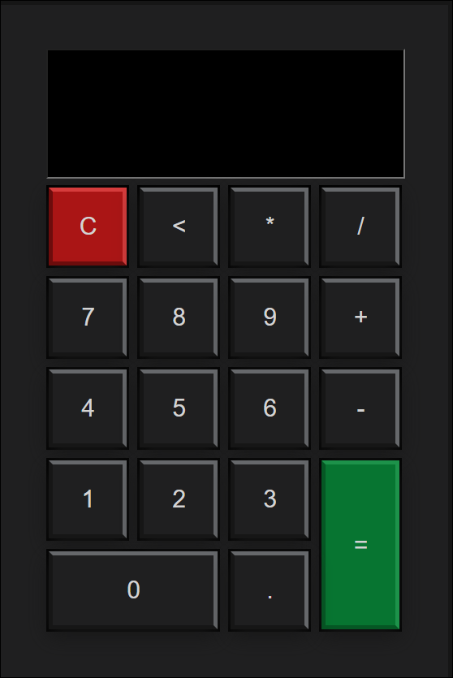

# Calculadora Simples

Este projeto é uma revisão prática sobre os conceitos de HTML, CSS e JavaScript. A calculadora permite realizar operações matemáticas básicas, como adição, subtração, multiplicação e divisão. O foco principal deste projeto é a criação de uma interface com a capacidade de realizar cálculos, além de funções como limpeza de tela, exibição de resultados e manipulação de entradas.

  

